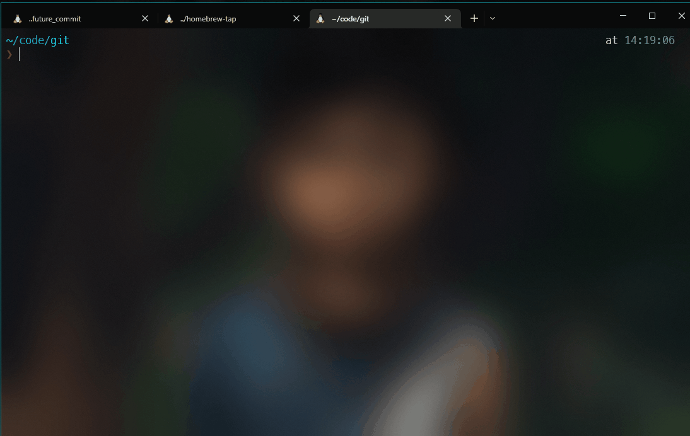

# What?
A tiny utility to `git commit` in the future.  


# Install


```
brew tap raevilman/tap
brew install future-commit
```

# Demo



</br>
</br>
</br>
---

## Development

### Prerequisites
- Node.js (v14 or higher)
- npm
- Git

### Setup
1. Clone the repository:
   ```bash
   git clone https://github.com/raevilman/future-commit.git
   cd future-commit
   ```

2. Install dependencies:
   ```bash
   npm install
   ```

### Running Locally
Run the tool directly with Node.js:
```bash
node index.js 1h -m "Test commit message"
```

Or make it executable and run:
```bash
chmod +x index.js
./index.js 1h -m "Test commit message"
```

### Testing
```bash
# Run all tests
npm test

# Run tests with coverage
npm run test:coverage

# Run tests in watch mode
npm run test:watch

# Run specific test file
npx jest tests/index.test.js
```

### Building
```bash
# Build for distribution
npm run build

# Package as executable
npm run package
```

### Project Structure
```
├── index.js           # Main CLI script
├── package.json       # Dependencies and scripts
├── docs/             # Documentation
│   └── testing.md          # Test coverage and strategy
├── tests/            # Test suite
│   ├── index.test.js        # Unit tests
│   ├── integration.test.js  # Integration tests
│   ├── edge-cases.test.js   # Edge case tests
│   ├── performance.test.js  # Performance tests
│   └── setup.js            # Test configuration
├── build/            # Built files (generated)
└── dist/             # Packaged executables (generated)
```

### Contributing
1. Fork the repository
2. Create a feature branch: `git checkout -b feature-name`
3. Make your changes
4. Add tests for new functionality
5. Ensure all tests pass: `npm test`
6. Commit your changes: `git commit -m "Description"`
7. Push to your fork: `git push origin feature-name`
8. Create a pull request

### Debugging
For verbose test output:
```bash
VERBOSE_TESTS=1 npm test
```

To test without actual git commits:
```bash
node index.js 1h -m "test" --dry-run
```